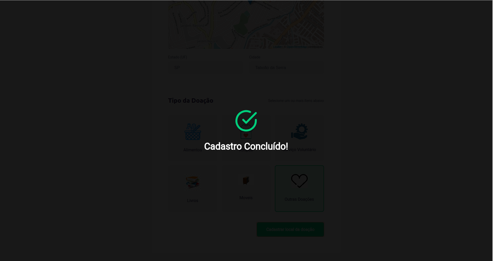
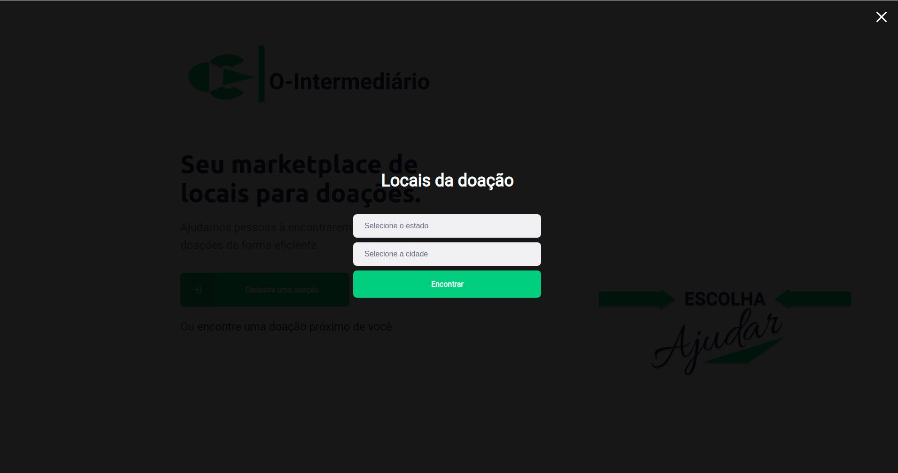

[See the readme in english](README.md)

# Ajude Pessoas: O-Intermediário

Esse é o projeto **O-Intermediário**, criado para ligar **O Doador ao que receberá a Doação** criado pela **Abel Sena / DevSenaCode**. 

<div align="center">
    
</div>


## :information_source: Sobre

This is the **O-Intermediário** project created in order to **help people who need any kind of donations**. This repository contains three projects:

1 - Back-end em NodeJS (API) no diretório `/server`.

2 - Front-end em ReactJS no diretório `/web`.

3 - Aplicativo mobile com React-Native e Expo no diretório `/mobile`.


## :heart: Pontos principais do Projeto

 **Ponto Forte do Projeto O-Intermediário** foi o uso do **Typescript** em todas as aplicações (**NodeJS API**, **ReactJS** and **React-Native**). Isso foi uma boa introdução, para mim, ao **typescript**. Outro ponto bom foi o uso do **knex** no ambiente **Node** e, obviamente, toda a parte do **Node** pois sou um iniciante com ele, tendo mais familiaridade com o **ReactJS** e **React-Native**.

Outro ponto, interessante para mim, foi o uso do **expo** pois, com meu hardware levemente obsoleto (hahaha), só consigo executar aplicações mobile com o **expo** (Obrigado a toda a comunidade **expo**).

## :book: Coisas que aprendi

- Usar o **TypeScript**. Amei usar **TypeScript** pela primeira vez.

- Um pouco mais sobre "chamar" API's, pois no projeto foram utilizadas a API do IBGE e a API criada para o Back-end no projeto.

- Mais sobre os componentes, **useState** e **useEffect** no **React**.

- Upload de arquivos com o **NodeJS**.

- Usar mapas em projetos com o **ReactJS** e o **React-Native**.


### :pager: Back-End

- Adicionado o limite de tamanho de arquivo para `1MB` no upload de arquivo.

- Alterado a funcionalidade de procurar pontos, deixando os items opcionais (Usado no front-end para criar a busca por estado e cidade na versão web).

- Criado um middleware para capturar os erros (Será usado no futuro para enviar informações sobre os erros do back-end para o front-end {Veja [isso na seção Futuro](#Enviar-informações-de-erros-para-o-front-end)}).

- Movido a parte de validação para um middleware para deixar o arquivo `routes.ts` mais limpo.

### :computer: Front-End

- Adicionado uma modal com informação de cadastro concluído

<div align="center">
    
</div>

- Adicionado validação no Front-end no formulário de criação de ponto de coleta (usando o pacote `yup`).


- Foi criado uma página com busca por estado (UF) e cidade e adicionado suporte para mostrar a localização no mapa na aplicação web.

<div align="center">
    
</div>

- Adicionada uma pequena página de erro 404 (Eu não gosto de deixar só uma página branca, como tinha ficado hahaha).

<div align="center">
    
</div>

- Adicionado limite de arquivos para 1MB no Front-end também.

### :iphone: Mobile

- Adicionado seleção de estado (UF) e cidade com suporte a API do IBGE.

- Adicionado um botão\link para abrir a localização em outros apps (por exemplo, no aplicativo **Uber**).

## :floppy_disk: Como rodar

A primeira coisa sobre rodar essa aplicação é que você precisa mudar o IP em todos os arquivos que utilizam o ip do servidor back-end, nos projetos `server`, `web` e `mobile` (Faça isso após o servidor back-end estar rodando).

### 1 - Clonar o repositório

```bash
git clone https://github.com/SenaBel/O-Intermediario.git
cd O-Intermediario
```

### 2 - Instalar as dependências e rodar o back-end

A partir do diretório `O-Intermediario`, vá para `server` e execute o comando `npm install`.

```bash
cd server
npm install
```

Depois de instalar as dependências, execute os comandos `knex:migrate` e `knex:seed` para criar o banco de dados `.sqlite`.

```bash
npm run knex:migrate
npm run knex:seed
```

Depois de criar o banco de dados, rode o script `dev` para executar o back-end.

```bash
npm run dev
```

### 3 - Mude o IP do localhost

Mude o IP do localhost para o seu IP de localhost nos arquivos:

#### Back-end

```
O-Intermediario/server/src/controllers/ItemsController.ts
O-Intermediario/server/src/controllers/PointsController.ts
```

#### Front-end

```
O-Intermediario/web/src/services/api.ts
```

#### Mobile

```
O-Intermediario/mobile/src/services/api.ts
```

### 4 - Instalar dependências e rodar o front-end em ReactJS

Do diretório `O-Intermediario`, vá para `web` e rode o comando `npm install`. Depois de instalar as dependências, execute o script `start`.

```bash
cd web
npm install
npm start
```

### 5 - Instalar as dependências e rodar o aplicativo mobile

Do diretório `O-Intermediario`, vá para `mobile` e rode o comando `npm install`. Depois de instalar as dependências, rode o script `start`.

```bash
cd mobile
npm install
npm start
```

E, agora, escaneie o QRCode do terminal no seu celular, com o aplicativo do expo.

## :flags: Futuro

Algumas funcionalidades que eu desejo adicionar nessa aplicação não estão, ainda, nessa versão e, nessa seção, eu decidi listar cada uma dessas funcionalidades para uma ajuda mental para as próximas alterações no código. Aqui as funcionalidades são listadas sem separação de back-end, front-end ou mobile. Isso é como se fosse uma lista To-Do.

### Enviar informações de erros para o front-end

Usando o `response.status(400)` ou outros códigos como resposta no *error handler*, o front-end em JavaScript não pode receber isso. No futuro eu quero mudar a forma de retornar as informações (em todas as rotas) para suportar o envio de erros como um parâmetro opcional nas informações enviadas com o código de retorno `200`.

### Adicionar suporte para autenticação e editar informações

Adicionar, no futuro, um campo de senha na página de cadastro e adicionar autenticação para suportar a edição de informações sobre cada ponto.

### (Mobile Only) Posição de inicialização do mapa

No futuro, eu quero inicializar o mapa na cidade e estado selecionado e não na localização do celular. Isso porque não faz sentido para uma pessoa procurando um ponto em outra cidade e a visualização do mapa inicializar na cidade em que ela está.

### (Mobile Only) Criar pontos

Adicionar suporte para criar pontos no aplicativo para celular.

## :DevSenaCode: Criador

### Abel Sena

- GitHub: [@SenaBel](https://github.com/SenaBel)
- LinkedIn: [@Abel Sena](www.linkedin.com/in/abel-sena)

