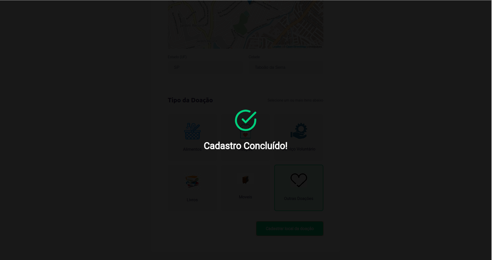
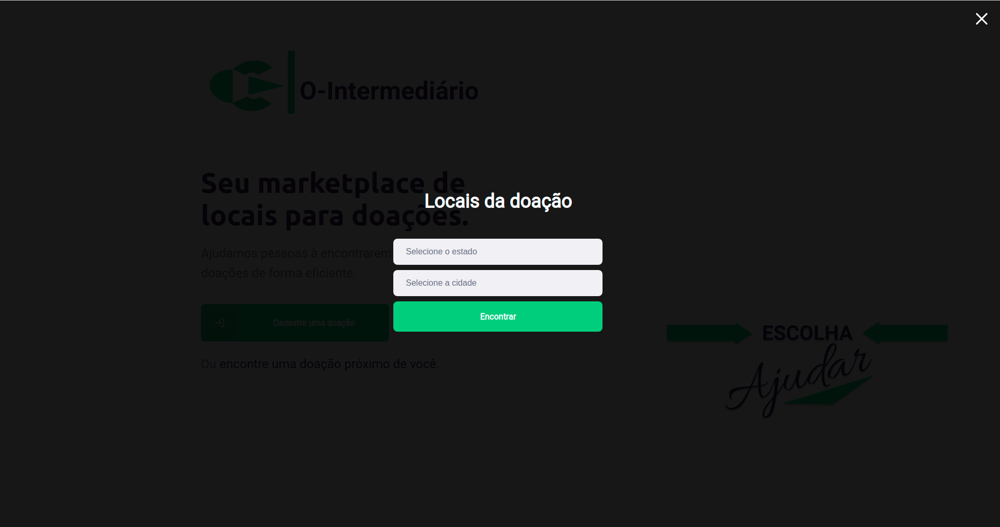
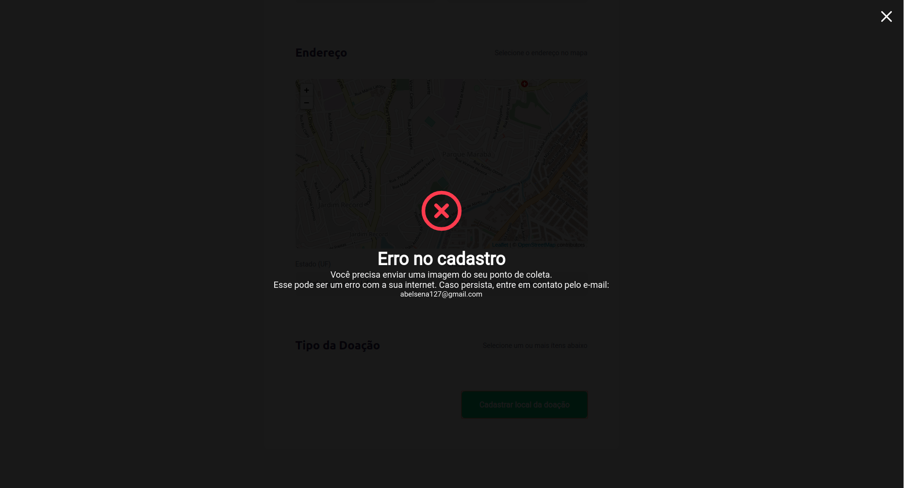

[Ver o Leia-Me em Português](README-pt-br.md)

# :Helpe People: O-Intermediário

This is the **O-Intermediário** project, created to link **The Donor to the one who will receive the Donation** created by **Abel Sena / DevSenaCode**.

<div align="center">
    
</div>

## :information_source: About

This is the **O-Intermediário** project created in the **Next Level Week** event made by **Abel Sena / DevSenaCode**. This repository contains three projects:

1 - NodeJS back-end API, in the `/server` path.

2 - ReactJS web front-end, in the `/web` path.

3 - React-Native with expo mobile app, in the `/mobile` path.

## :heart: Main Points of the Project

**Strength of the O-Intermediate Project** is the use of ** Typescript ** in all applications (**API NodeJS**, **ReactJS App** and **React-Native App**) This is good initial information for me in **typescript**. Another positive point is the use of the **knex** package in the node and, obviously, the **Node** part of the event, because I am a beginner in **Node** with a little more familiarity with ** ReactJS** and **React-Native**.

Other point, interesting to me is the use of **expo** because, with my oldest hardware i can run mobile apps only because **expo** (Thanks for all **expo** community).

## :book: Things i Learned

- Using **TypeScript**. I loved to use **TypeScript** for the first time.

- A little bit more about calling API's, because in this project we use the IBGE state and city API and the API created in the first part of the project.

- More about components, **useState** and **useEffect** on the **React**.

- File upload in **NodeJS**.

- Using maps in **ReactJS** and **React-Native** projects.

### :pager: Back-End

- Setted the limitation of `1MB` image size in file upload.

- Made the search points including items optional (used this for the Front-end points search by state and city).

- Created error handler middlewares (it will be used in the future for send errors from back-end to front-end {see [this in Future section](#Send-errors-informations-from-back-end-for-front-end)}).

- Moved validations to an middleware to clean the `routes.ts` file.

### :computer: Front-End

- Added an modal with success registration

<div align="center">
    
</div>

- Added Front-end side validation in the create point form (using the `yup` package).

- Make the front-end application more responsive.

- Created an point search for state (UF) city and add support for showing the point in the map in front-end web application.

<div align="center">
    
</div>

- Added an tiny 404 page (This is created because i not like the app white screen in not-found routes).

<div align="center">
    
</div>

- Added limitation for 1MB images in front-end page

### :iphone: Mobile

- Added state (UF) and city selector with IBGE API support:

- Added an button\link to open the map location with external apps (e.g. opening in **Uber** app).

## :floppy_disk: How to run

The first thing about run this app you need know is: you need to change the IP in all files using the back-end server ip in `server`, `web` and `mobile` projects (make this, after the back-end server started).

### 1 - Clone the repository

```bash
git clone https://github.com/SenaBel/O-Intermediario.git
cd O-Intermediario
```

### 2 - Install dependencies and run node back-end

From the `O-Intermediario` root folder, go to the `server` path and run the `npm install` command.

```bash
cd server
npm install
```

After installing dependencies, run the `knex:migrate` and the `knex:seed` npm scripts to create `.sqlite` database.

```bash
npm run knex:migrate
npm run knex:seed
```

After creating database, run the `dev` npm script to execute the devlopment server.

```bash
npm run dev
```

And, now, the server is started.

### 3 - Change the localhost IP

Change the localhost IP to your localhost IP in those files:

#### Back-end

```
O-Intermediario/server/src/controllers/ItemsController.ts
O-Intermediario/server/src/controllers/PointsController.ts
```

#### Front-end

```
O-Intermediario/web/src/services/api.ts
```

#### Mobile

```
O-Intermediario/mobile/src/services/api.ts
```

### 4 - Install dependencies and run ReacJS front-end

From the `O-Intermediario` root folder, go to the `web` path and run the `npm install` command. After the install of dependencies, run the `start` npm script.

```bash
cd web
npm install
npm start
```

### 5 - Install dependencies and run mobile React-Native app

From the `O-Intermediario` root folder, go to the `mobile` path and run the `npm install` command. After the install of dependencies, run the `start` npm script.

```bash
cd mobile
npm install
npm start
```

Now, scan the QRCode from the terminal to your mobile phone expo application.

## :flags: Future

Some features, that i want to add to this project was not in this version and, in this section, i decided to list each of this features for a mental helper for next changes in this code. Here, this features are listed without separation of back-end, front-end or mobile. This is like an To-Do list.

### Send errors informations from back-end for front-end

Using the `response.status(400)` or other codes, in back-end, as response in error handlers, the JavaScript front-end can't receive this (Network error). In the future i want to change the information return (in all routes) to support sending errors as optionally data information and send all as `200` status code.

### Add support to authentication and edit informations

Add, in the future, password field in create point form and add authentication support to edit information.

### (Mobile Only) Change the Map Initialization position

In the future, i want to initialize the map in the selected state and city and not in the phone location. This is because not make sense for a people locating a point in other city and the map visualization initialize in your city. I need an API (or an json database to read locally) to get the map coordinates for the city or state.

### (Mobile Only) Create Point

Add support to create point in the mobile application.

## :DevSenaCode: Creator

### Abel Sena

- GitHub: [@SenaBel](https://github.com/SenaBel)
- LinkedIn: [@Abel Sena](www.linkedin.com/in/abel-sena)
